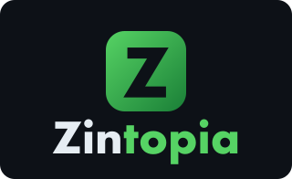

<p align="center">
  <picture>
    <source media="(prefers-color-scheme: light)" srcset="docs/logo-stacked.svg">
    
  </picture>
</p>

<p align="center">
  <a href="#english">English</a>
  ·
  <a href="#chinese">中文</a>
</p>

# Zintopia

<a id="english"></a>

Local US-stock research terminal: quotes, charts, movers, watchlist, a stock portfolio simulator, and optional LLM / heuristic analysis.

Open [http://localhost:5173](http://localhost:5173) after starting the app. Click a ticker (or search) to load its quote and chart. Use **Stock portfolio** to create a paper fund (name + starting dollars), simulate share trades, or attach a simple automatic strategy. Options are not supported. Deep analysis loads when you select a stock. The LLM research dialog stays on the ticker page (starter chips plus follow-ups) when a key is set.

This is a research UI, not a broker. **Not financial advice.** Data can be delayed, incomplete, or wrong.

## Features

- GitHub-style dark UI: watchlist, US movers (gainers / losers / active), index strip (SPY, QQQ, DIA, IWM, VIX)
- Watchlist persisted in the browser (`localStorage`); add with ★, remove with ×
- Search by ticker or name
- OHLCV chart; default range is **1D** (`1d` / `5d` / `1mo` / `3mo` / `6mo` / `1y` / `5y`)
- Daily TradingView technical rating, Yahoo news, and company profile
- **Stock portfolio simulation**: virtual funds that buy and sell **shares** of US stocks and ETFs, with optional auto strategies, live NAV / P/L, and a **Vibe dialog** (Yahoo last/news + TradingView daily TA, then an LLM review you can follow up in the same conversation). Requires `OPENAI_API_KEY` or `ANTHROPIC_API_KEY`. No options. Not a broker.
- **Deep analysis**: insider Form 4 flow, option volume / put-call, official Senate and House **periodic transaction reports** (not live holdings), analyst targets, headlines, and a heuristic stance (`ACCUMULATE` … `AVOID`)
- **LLM research dialog**: type a question or use the BUY / SELL / LONG CALL / LONG PUT starter, with macro context (SPY, QQQ, DIA, IWM, VIX) via OpenAI or Anthropic, then follow-ups in the same conversation. Requires a key; use **Stop** to cancel an in-flight reply.

Clicking a stock shows the header quote immediately when the ticker is already on the strip, watchlist, or movers. Charts and quotes cache briefly so switching back is faster.

## Quick start

Needs [Python 3.12+](https://www.python.org/), [uv](https://docs.astral.sh/uv/), Node.js, and npm.

```bash
chmod +x start.sh
./start.sh
```

| | URL |
|---|---|
| UI | http://localhost:5173 |
| API docs | http://localhost:8000/docs |

`start.sh` loads `.env` if present, creates `backend/.venv`, installs Python and npm deps, starts FastAPI on port 8000 (`--host ::`), then Vite on 5173 (Vite proxies `/api` to the backend).

On macOS, `start.sh` sets `ZINTOPIA_BIND_INTERFACE=en0` so outbound HTTPS can bind to Wi-Fi when automatic source-address selection fails (`Errno 49` / “Can't assign requested address”). Override with `ZINTOPIA_BIND_INTERFACE=` or `ZINTOPIA_BIND_IP=`. `FINTOPIA_*` and `UTOPIA_*` names still work as aliases.

## Stock portfolio simulation

The **Stock portfolio** tab is a local paper-trading sandbox for **US stocks and ETFs**. It does not support options (calls, puts, or spreads). Nothing is sent to a broker. During regular hours, fills and NAV use the same quote stack as the research UI. When the NYSE cash session is closed (Eastern time), NAV and paper fills mark to Yahoo **pre-market** (4:00–9:30) or **after hours** (16:00–20:00); overnight and weekends use the last extended print.

1. Open **Stock portfolio** in the header.
2. Create a fund with a name and starting cash (for example `100000`).
3. Place simulated **buy** / **sell** share orders by quantity or dollar amount, or attach an automatic strategy and turn **Auto** on.
4. Watch NAV, cash, unrealized P/L, max drawdown, the NAV chart, holdings, and the trade log.
5. Use the **Vibe dialog** on the fund page. **Analyze fund** posts a structured review; type in the box to follow up on the same conversation (Yahoo quotes/news and daily TA, same US stack as [Vibe-Trading MCP](https://github.com/HKUDS/Vibe-Trading)). Requires `OPENAI_API_KEY` or `ANTHROPIC_API_KEY`. Click a ticker in the notes to load it into the paper order ticket.

Performance (NAV chart and marked-to-market P/L) refreshes every 30 seconds (`ZINTOPIA_CHART_REFRESH_SEC`). Auto strategies try a step every hour while `./start.sh` is running (`ZINTOPIA_STRATEGY_INTERVAL_SEC`, default `3600`). Use **Run one step now** to force a strategy tick immediately.

| Strategy | What it does |
|---|---|
| Manual | You place paper buy/sell orders in shares (no options). |
| Buy & hold | Invests remaining cash in one ticker and holds. |
| SMA crossover | Buys when SMA20 > SMA50; sells on a cross down. |
| Momentum | Rotates into the top 3 US gainers, equal weight. |
| RSI mean reversion | Buys ~25% of cash when RSI < 30; sells when RSI > 70. |

Funds are stored locally in `~/.zintopia/portfolios.json` (outside the git repo). The same directory holds the Congress PTR cache (`congress_ptr.json`). Override with `ZINTOPIA_DATA_DIR`. Deleting a fund in the UI removes it. Restarting the app does not reset paper cash or trades.

This is research / simulation only, and **shares only** (no options). **Not financial advice.** You can lose real money if you copy these ideas in a live account.

## Optional keys

The app runs with no keys. Unsigned TradingView scanner quotes are typically **~15 minutes delayed**.

Copy the template and fill in what you use:

```bash
cp .env.example .env
```

| Variable | Purpose |
|---|---|
| `ZINTOPIA_LIVE_REFRESH_SEC` | Selected ticker **price** poll interval in seconds (default `10`). News and Daily TA stay on-demand. |
| `ZINTOPIA_CHART_REFRESH_SEC` | Stock charts, NAV chart, and portfolio performance poll in seconds (default `30`). |
| `ZINTOPIA_STRATEGY_INTERVAL_SEC` | How often auto paper strategies try a step while the server is up (default `3600` = 1 hour). |
| `ZINTOPIA_DATA_DIR` | Local JSON dir for paper funds and the Congress PTR cache (default `~/.zintopia`). |
| `ZINTOPIA_HTTP_POOL_SIZE` | Keep-alive connection pool for outbound quote HTTP (default `20`, clamp 2–128). |
| `POLYGON_API_KEY` or `MASSIVE_API_KEY` | Last-trade snapshots (realtime when the plan allows) |
| `OPENAI_API_KEY` / `OPENAI_MODEL` | LLM research and Vibe dialogs (default model `gpt-4.1`) |
| `ANTHROPIC_API_KEY` / `ANTHROPIC_MODEL` | LLM research and Vibe dialogs (default `claude-opus-4-20250514`) |
| `LLM_PROVIDER` | `auto` (OpenAI first if both keys are set), `openai`, or `anthropic` |

Free Polygon signup: https://polygon.io/dashboard/signup

A free Polygon plan may still reject some snapshot endpoints (`NOT_AUTHORIZED`). Quotes then fall back automatically.

## Data sources

| Panel | Source |
|---|---|
| Quotes / indices / watchlist | Polygon snapshot (if keyed) → TradingView scanner → yfinance download → Yahoo ticker → Stooq |
| Charts | Yahoo Finance `yf.download` |
| Movers | TradingView scanner, then Polygon gainers/losers if keyed |
| Daily TA | tradingview-ta |
| Profile, news, insiders, options, analyst targets | Yahoo Finance (`yfinance`) |
| Senate / House PTR trades | Official STOCK Act filings: House Clerk `YYYYFD.zip` + PTR PDFs; Senate eFD search (`efdsearch.senate.gov`). These are **trades**, not live holdings; filers have up to 45 days to disclose. Cached in `~/.zintopia/congress_ptr.json` (refreshed in the background, default 120-day lookback) |
| LLM research / Vibe dialogs | OpenAI or Anthropic when a key is set |
| Paper stock-portfolio marks / fills | Regular hours: same quote stack as `/api/quote`. When the NYSE cash session is closed (Eastern time): Yahoo **pre-market** (4:00–9:30), **after hours** (16:00–20:00), or last extended print overnight/weekend. SMA strategies use Yahoo `yf.download` history |

Do not treat unsigned TradingView or Yahoo prints as exchange-realtime.

## API

| Route | Role |
|---|---|
| `GET /api/health` | Liveness, Polygon flag, LLM provider flags, NYSE session (`market`) |
| `GET /api/network-test` | Outbound HTTPS diagnostic |
| `GET /api/indices` | SPY, QQQ, DIA, IWM, VIX |
| `GET /api/snapshot` | Indices + mover boards |
| `GET /api/quote/{symbol}` | One quote |
| `GET /api/quotes?symbols=AAPL,MSFT` | Watchlist |
| `GET /api/movers?kind=gainers\|losers\|active` | US stocks |
| `GET /api/history/{symbol}?range=1d\|5d\|1mo\|3mo\|6mo\|1y\|5y` | OHLCV |
| `GET /api/profile/{symbol}` | Company profile |
| `GET /api/news/{symbol}` | Headlines |
| `GET /api/ta/{symbol}` | Daily TA summary |
| `GET /api/search?q=` | Symbol search |
| `GET /api/deep/{symbol}` | Insiders, options, official House/Senate PTRs, news, forecast, heuristic suggestion |
| `POST /api/llm-advice/{symbol}` | Start LLM research conversation (BUY/SELL/LONG CALL/LONG PUT) |
| `POST /api/llm-advice/{symbol}/chat` | Follow-up in the same `conversation_id` |
| `GET /api/portfolios` | Stock portfolio summaries (marked to market) |
| `POST /api/portfolios` | Create fund `{name, amount}` |
| `GET /api/portfolios/{id}` | Holdings, trades, NAV snapshots |
| `DELETE /api/portfolios/{id}` | Delete fund |
| `POST /api/portfolios/{id}/orders` | Paper buy/sell (`shares` or `notional`) |
| `PUT /api/portfolios/{id}/strategy` | `manual` / `buy_hold` / `sma_cross` / `momentum` / `rsi_reversion` |
| `POST /api/portfolios/{id}/vibe` | Start Vibe paper-fund conversation (Yahoo + daily TA, then LLM) |
| `POST /api/portfolios/{id}/vibe/chat` | Follow-up on the same `conversation_id` |

## Repo layout

```
backend/app.py           FastAPI app
backend/congress_ptr.py  House Clerk + Senate eFD PTR cache
backend/portfolios.py    Stock portfolio simulation (shares only, no options)
backend/llm_advice.py    OpenAI / Anthropic calls
backend/requirements.txt
frontend/                Vite + React + Lightweight Charts
start.sh                 Dev launcher (loads .env if present)
.env.example             Key placeholders — copy to .env locally
~/.zintopia/             Local paper funds + PTR cache (not in git)
```

## Secrets

Never commit `.env` or API keys. `.env` is gitignored. `.env.example` only shows empty variable names and example model ids.

Deep analysis and LLM output are research aids over public feeds. You can lose money.

## License

[MIT](LICENSE) © 2026 Zidong

---

<a id="chinese"></a>

<p align="center">
  <a href="#english">English</a>
  ·
  <b>中文</b>
</p>

# Zintopia（中文）

本地美股研究终端：行情、K 线、涨跌榜、自选、股票组合模拟，以及可选的 LLM / 启发式分析。

启动后打开 [http://localhost:5173](http://localhost:5173)。点击代码（或搜索）即可加载报价与图表。用 **Stock portfolio** 创建模拟组合（名称 + 起始资金），模拟股票买卖，或挂上简单自动策略。不支持期权。选中一只股票后会加载深度分析。配置密钥后，LLM 研究对话会留在该股票页（快捷芯片 + 追问）。

这是研究界面，不是券商。**不构成投资建议。** 数据可能延迟、不完整或有误。

## 功能

- GitHub 风格深色界面：自选、美股涨跌榜（涨幅 / 跌幅 / 活跃）、指数条（SPY、QQQ、DIA、IWM、VIX）
- 自选保存在浏览器（`localStorage`）；★ 添加，× 删除
- 按代码或名称搜索
- OHLCV 图表；默认区间 **1D**（`1d` / `5d` / `1mo` / `3mo` / `6mo` / `1y` / `5y`）
- 日线 TradingView 技术评级、Yahoo 新闻、公司资料
- **股票组合模拟**：虚拟资金买卖美股与 ETF **正股**，可选自动策略、实时净值 / 盈亏，以及 **Vibe 对话**（Yahoo 最新价/新闻 + TradingView 日线技术分析，再由 LLM 点评，可在同一会话追问）。需要 `OPENAI_API_KEY` 或 `ANTHROPIC_API_KEY`。不支持期权。不是券商。
- **深度分析**：内部人 Form 4 流向、期权成交量 / 看跌看涨比、参众两院官方 **定期交易报告**（不是实时持仓）、分析师目标价、头条，以及启发式立场（`ACCUMULATE` … `AVOID`）
- **LLM 研究对话**：自行提问，或使用 BUY / SELL / LONG CALL / LONG PUT 快捷入口，并带上宏观背景（SPY、QQQ、DIA、IWM、VIX），经 OpenAI 或 Anthropic 回答，可在同一会话追问。需要密钥；用 **Stop** 取消进行中的回复。

若该代码已在指数条、自选或涨跌榜上，点击后会立刻显示顶部报价。图表与报价有短暂缓存，切回更快。

## 快速开始

需要 [Python 3.12+](https://www.python.org/)、[uv](https://docs.astral.sh/uv/)、Node.js 和 npm。

```bash
chmod +x start.sh
./start.sh
```

| | 地址 |
|---|---|
| 界面 | http://localhost:5173 |
| API 文档 | http://localhost:8000/docs |

`start.sh` 若存在会加载 `.env`，创建 `backend/.venv`，安装 Python 与 npm 依赖，在 8000 端口启动 FastAPI（`--host ::`），再在 5173 启动 Vite（Vite 把 `/api` 代理到后端）。

在 macOS 上，`start.sh` 会设置 `ZINTOPIA_BIND_INTERFACE=en0`，以便自动源地址选择失败时（`Errno 49` / “Can't assign requested address”）出站 HTTPS 绑定到 Wi-Fi。可用 `ZINTOPIA_BIND_INTERFACE=` 或 `ZINTOPIA_BIND_IP=` 覆盖。`FINTOPIA_*` 与 `UTOPIA_*` 名称仍可作为别名。

## 股票组合模拟

**Stock portfolio** 是本地纸上交易沙盒，只做 **美股与 ETF 正股**。不支持期权（看涨、看跌或价差）。不会把订单发到券商。常规交易时段内，成交与净值使用与研究界面相同的行情栈。纽交所现金时段关闭时（美国东部时间），净值与模拟成交按 Yahoo **盘前**（4:00–9:30）或 **盘后**（16:00–20:00）计价；隔夜与周末使用最近一次延长时段成交价。

1. 在顶栏打开 **Stock portfolio**。
2. 用名称和起始资金创建组合（例如 `100000`）。
3. 按股数或金额下模拟 **买** / **卖** 订单，或挂上自动策略并打开 **Auto**。
4. 查看净值、现金、未实现盈亏、最大回撤、净值图、持仓与成交记录。
5. 在组合页使用 **Vibe 对话**。**Analyze fund** 会提交结构化点评；在输入框继续提问即同一会话追问（Yahoo 行情/新闻与日线技术分析，数据栈与 [Vibe-Trading MCP](https://github.com/HKUDS/Vibe-Trading) 相同）。需要 `OPENAI_API_KEY` 或 `ANTHROPIC_API_KEY`。点击笔记中的代码，可填入模拟下单框。

业绩（净值图与盯市盈亏）每 30 秒刷新（`ZINTOPIA_CHART_REFRESH_SEC`）。`./start.sh` 运行期间，自动策略每小时尝试一步（`ZINTOPIA_STRATEGY_INTERVAL_SEC`，默认 `3600`）。用 **Run one step now** 可立刻强制跑一步。

| 策略 | 行为 |
|---|---|
| Manual | 自行下模拟买卖单（正股，无期权）。 |
| Buy & hold | 把剩余现金买入一只代码并持有。 |
| SMA crossover | SMA20 > SMA50 时买入；死叉卖出。 |
| Momentum | 等权轮动美股涨幅前 3。 |
| RSI mean reversion | RSI < 30 时用约 25% 现金买入；RSI > 70 时卖出。 |

组合存在本地 `~/.zintopia/portfolios.json`（不进 git）。同一目录还有国会 PTR 缓存（`congress_ptr.json`）。可用 `ZINTOPIA_DATA_DIR` 覆盖。在界面删除组合即删除数据。重启应用不会清空模拟资金或成交。

仅供研究 / 模拟，且 **只做正股**（无期权）。**不构成投资建议。** 若把这些想法用到实盘，可能亏真金。

## 可选密钥

无密钥也能运行。未登录的 TradingView 扫描行情通常 **延迟约 15 分钟**。

复制模板并填入你要用的项：

```bash
cp .env.example .env
```

| 变量 | 用途 |
|---|---|
| `ZINTOPIA_LIVE_REFRESH_SEC` | 当前股票 **价格** 轮询间隔，秒（默认 `10`）。新闻与日线技术分析仍按需加载。 |
| `ZINTOPIA_CHART_REFRESH_SEC` | 股票图、净值图与组合业绩轮询间隔，秒（默认 `30`）。 |
| `ZINTOPIA_STRATEGY_INTERVAL_SEC` | 服务运行时自动策略尝试一步的间隔（默认 `3600` = 1 小时）。 |
| `ZINTOPIA_DATA_DIR` | 模拟组合与国会 PTR 缓存的本地 JSON 目录（默认 `~/.zintopia`）。 |
| `ZINTOPIA_HTTP_POOL_SIZE` | 出站行情 HTTP 的 keep-alive 连接池（默认 `20`，限制 2–128）。 |
| `POLYGON_API_KEY` 或 `MASSIVE_API_KEY` | 最新成交快照（套餐允许时为实时） |
| `OPENAI_API_KEY` / `OPENAI_MODEL` | LLM 研究与 Vibe 对话（默认模型 `gpt-4.1`） |
| `ANTHROPIC_API_KEY` / `ANTHROPIC_MODEL` | LLM 研究与 Vibe 对话（默认 `claude-opus-4-20250514`） |
| `LLM_PROVIDER` | `auto`（两个密钥都有时优先 OpenAI）、`openai` 或 `anthropic` |

免费注册 Polygon：https://polygon.io/dashboard/signup

免费套餐仍可能拒绝部分 snapshot 接口（`NOT_AUTHORIZED`）。行情会自动回退。

## 数据来源

| 面板 | 来源 |
|---|---|
| 行情 / 指数 / 自选 | Polygon snapshot（有密钥时）→ TradingView scanner → yfinance download → Yahoo ticker → Stooq |
| 图表 | Yahoo Finance `yf.download` |
| 涨跌榜 | TradingView scanner，有密钥时再试 Polygon 涨跌幅 |
| 日线技术分析 | tradingview-ta |
| 资料、新闻、内部人、期权、分析师目标价 | Yahoo Finance（`yfinance`） |
| 参众两院 PTR 交易 | 官方 STOCK Act 申报：众议院书记官 `YYYYFD.zip` + PTR PDF；参议院 eFD 检索（`efdsearch.senate.gov`）。这些是 **交易**，不是实时持仓；申报人最多有 45 天披露期。缓存于 `~/.zintopia/congress_ptr.json`（后台刷新，默认回看 120 天） |
| LLM 研究 / Vibe 对话 | 配置密钥后使用 OpenAI 或 Anthropic |
| 模拟组合计价 / 成交 | 常规时段：与 `/api/quote` 相同行情栈。纽交所现金时段关闭时（东部时间）：Yahoo **盘前**（4:00–9:30）、**盘后**（16:00–20:00），或隔夜/周末最近一次延长时段成交价。SMA 策略使用 Yahoo `yf.download` 历史 |

不要把未登录的 TradingView 或 Yahoo 报价当成交易所实时行情。

## API

| 路由 | 作用 |
|---|---|
| `GET /api/health` | 存活检查、Polygon 标志、LLM 提供方标志、纽交所时段（`market`） |
| `GET /api/network-test` | 出站 HTTPS 诊断 |
| `GET /api/indices` | SPY、QQQ、DIA、IWM、VIX |
| `GET /api/snapshot` | 指数 + 涨跌榜 |
| `GET /api/quote/{symbol}` | 单只报价 |
| `GET /api/quotes?symbols=AAPL,MSFT` | 自选 |
| `GET /api/movers?kind=gainers\|losers\|active` | 美股 |
| `GET /api/history/{symbol}?range=1d\|5d\|1mo\|3mo\|6mo\|1y\|5y` | OHLCV |
| `GET /api/profile/{symbol}` | 公司资料 |
| `GET /api/news/{symbol}` | 头条 |
| `GET /api/ta/{symbol}` | 日线技术分析摘要 |
| `GET /api/search?q=` | 代码搜索 |
| `GET /api/deep/{symbol}` | 内部人、期权、官方参众两院 PTR、新闻、预测、启发式建议 |
| `POST /api/llm-advice/{symbol}` | 开始 LLM 研究对话（BUY/SELL/LONG CALL/LONG PUT） |
| `POST /api/llm-advice/{symbol}/chat` | 同一 `conversation_id` 追问 |
| `GET /api/portfolios` | 股票组合摘要（盯市） |
| `POST /api/portfolios` | 创建组合 `{name, amount}` |
| `GET /api/portfolios/{id}` | 持仓、成交、净值快照 |
| `DELETE /api/portfolios/{id}` | 删除组合 |
| `POST /api/portfolios/{id}/orders` | 模拟买卖（`shares` 或 `notional`） |
| `PUT /api/portfolios/{id}/strategy` | `manual` / `buy_hold` / `sma_cross` / `momentum` / `rsi_reversion` |
| `POST /api/portfolios/{id}/vibe` | 开始 Vibe 模拟组合对话（Yahoo + 日线技术分析，再 LLM） |
| `POST /api/portfolios/{id}/vibe/chat` | 同一 `conversation_id` 追问 |

## 仓库结构

```
backend/app.py           FastAPI 应用
backend/congress_ptr.py  众议院书记官 + 参议院 eFD PTR 缓存
backend/portfolios.py    股票组合模拟（仅正股，无期权）
backend/llm_advice.py    OpenAI / Anthropic 调用
backend/requirements.txt
frontend/                Vite + React + Lightweight Charts
start.sh                 开发启动脚本（若存在则加载 .env）
.env.example             密钥占位 — 本地复制为 .env
~/.zintopia/             本地模拟组合 + PTR 缓存（不进 git）
```

## 密钥

不要提交 `.env` 或 API 密钥。`.env` 已被 gitignore。`.env.example` 只列出空变量名和示例模型 id。

深度分析与 LLM 输出是基于公开数据的研究辅助。你可能亏钱。

## 许可证

[MIT](LICENSE) © 2026 Zidong
